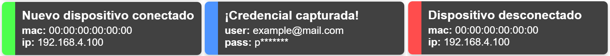

# 🛠️ Evil Twin Wi-Fi Demo con ESP8266

Este proyecto implementa una prueba de concepto (PoC) de ataque **Evil Twin** utilizando un microcontrolador **ESP8266**. Crea un *Access Point falso* con un **portal cautivo**, captura credenciales simuladas e información de dispositivos conectados, y visualiza los eventos en **tiempo real** mediante WebSockets.

> ⚠️ **Este proyecto fue desarrollado con fines educativos y de concientización en ciberseguridad ofensiva. No debe utilizarse fuera de entornos controlados y autorizados.**

---

## 📸 Vista general

---

## 🚀 Funcionalidades

- 🔌 Punto de acceso Wi-Fi sin contraseña
- 🧠 DNS Spoofing: redirige todo tráfico a `192.168.4.1`
- 🌐 Portal HTML simulado (login de UNGS Activa)
- 🔐 Captura de credenciales vía POST
- 🧩 Detección de dispositivos conectados (MAC/IP)
- ⏱️ Log de conexiones y desconexiones con timestamp
- 📡 Comunicación en tiempo real con WebSockets
- 💬 Notificaciones visuales ("toasts") por evento
- 🏷️ Resolución de fabricantes por MAC prefix (OUI), usando la base pública de [maclookup.app](https://maclookup.app/)

---

## ⚙️ Hardware utilizado

| Componente       | Función                                         |
|------------------|--------------------------------------------------|
| ESP8266 (ESP-01) | Punto de acceso, servidor DNS/HTTP/WebSocket   |
| Arduino Uno      | Programador serial para el ESP-01               |
| Batería 18650    | Fuente de alimentación portátil                 |
| Diodo 1N4007     | Reducción de voltaje a ~3.3 V                   |
| Carcasa 3D       | Alojamiento del módulo, batería e interruptor   |

---

## 🧰 Requisitos técnicos

- Arduino IDE o PlatformIO
- Librerías:
  - [`ESPAsyncWebServer`](https://github.com/me-no-dev/ESPAsyncWebServer)
  - [`DNSServer`](https://github.com/esp8266/Arduino/tree/master/libraries/DNSServer)
- Navegador compatible con WebSocket y JavaScript moderno

---

## 🧪 Uso

1. **Compilá y cargá** el firmware en el ESP8266 mediante el Arduino Uno en modo programador.
2. Encendé el ESP con la batería (vía diodo 1N4007).
3. Conectate a la red Wi-Fi generada (ej: `UNGS 100% Real No Fake`).
4. Abrí cualquier página → serás redirigido al portal falso.
5. Ingresá datos → se capturan y notifican en tiempo real.
6. Desde el navegador del presentador, accedé a:
   - `http://192.168.4.1/captures` → datos capturados
   - `http://192.168.4.1/log` → log histórico de conexiones
   - `http://192.168.4.1/obs-toast` → pantalla de solo notificaciones

---

## 🔐 Consideraciones éticas

Este proyecto fue desarrollado como trabajo final para la materia **Sistemas Operativos y Redes 2** con fines **exclusivamente académicos y demostrativos**. Su propósito es:

- Demostrar la facilidad con la que un atacante puede montar una red falsa.
- Concientizar sobre el uso seguro de redes Wi-Fi públicas.
- Mostrar la importancia de HTTPS, HSTS y validación de certificados.

⚠️ **No está permitido usar esta herramienta en redes reales sin consentimiento.**

---

## 📚 Créditos y agradecimientos

Proyecto desarrollado por **Tobias Rumiz** (UNGS - Lic. en Sistemas)

Se agradece a los docentes y ayudantes de la materia por permitir y fomentar trabajos aplicados con impacto pedagógico.

---

## 📝 Licencia

Este proyecto se distribuye bajo la licencia MIT. Para uso educativo únicamente.

